# .NET 開発テクノロジ入門 2016年版 Xamarin の章のサンプルプロジェクトです。

こんにちは。.NET 開発テクノロジ入門 2016年版 Xamarin の章の著者、エクセルソフトの田淵（[@ytabuchi](https://twitter.com/ytabuchi)）です。本章のおまけとして、Xamarin.Formsで2015年12月現在デプロイできる各種プロジェクトをサンプルプロジェクトとしてアップしました。NuGetパッケージの復元など少し処理が必要になりますので、以下に手順を記載します。

## ダウンロード後の手順

zip をダウンロードするか［Clone］して適当なフォルダに展開して`HelloXamarinForms.sln`を開きます。  
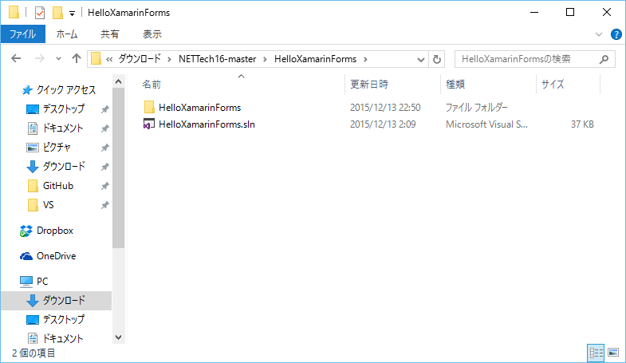

ソリューションフォルダを右クリックして、［NeGetパッケージの復元］をクリックします。  
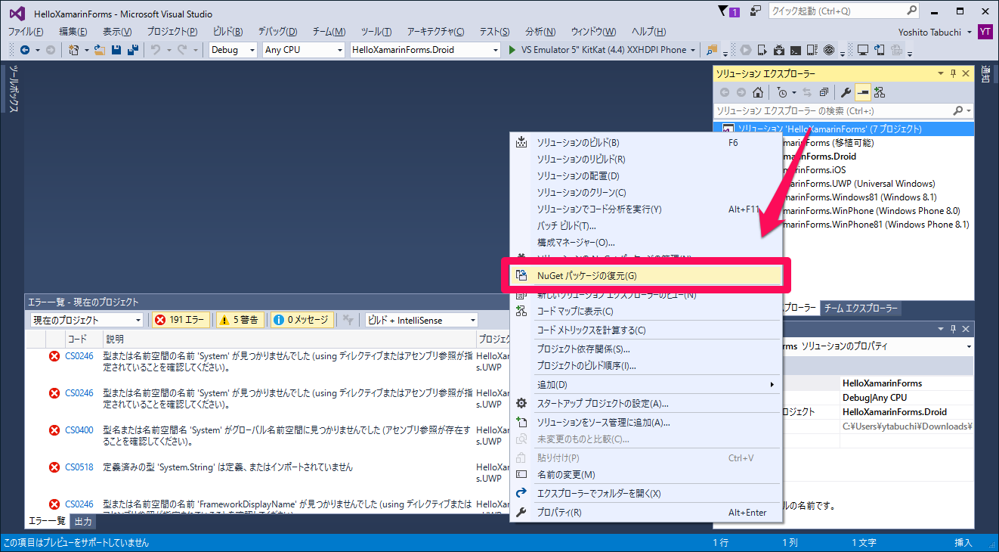

復元が完了しても、`HelloXamarinForms`プロジェクトの［参照］から［！］アイコンが消えないので、ファイルをクリックして［！］を消します。  
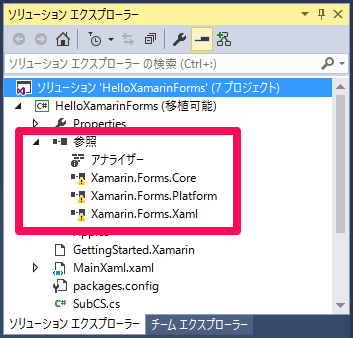 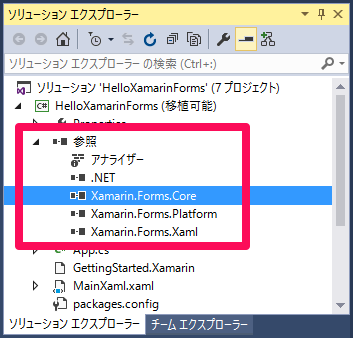

PCLの`HelloXamarinForms`プロジェクトをビルドしておきます。では上から順番にビルドしていきます。`HelloXamarinForms.Android`プロジェクトを右クリックして、［スタートアッププロジェクトに設定］をクリックします。

エラーが大量に発生することがありますが、ビルドすると消えるはずです。  
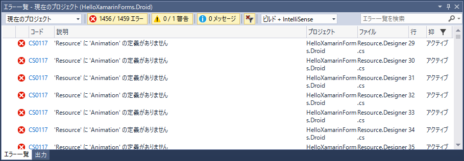

Androidをビルドできました。  
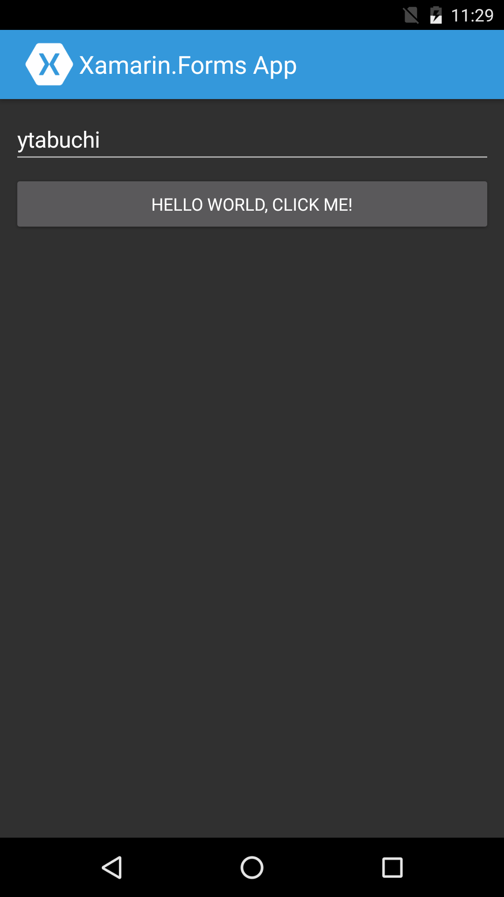

続いてiOSプロジェクトもビルドしてみましょう。  
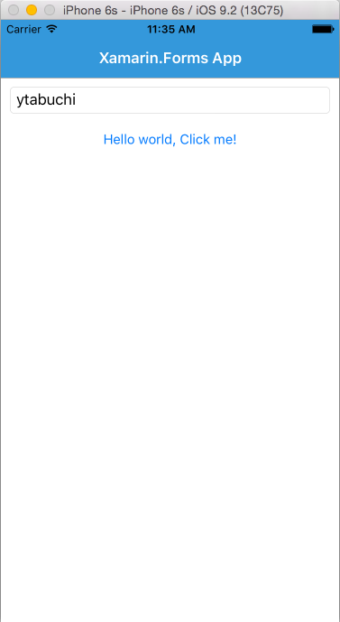

UWPプロジェクトをビルドします。

Windows 10 デスクトップでの実行  
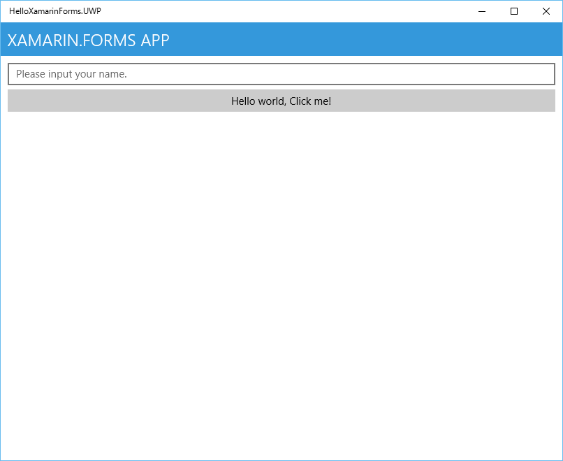  

UWPプロジェクトで［証明書ファイル 'HelloXamarinForms.UWP_TemporaryKey.pfx' が見つかりません］というエラーが表示されます。  
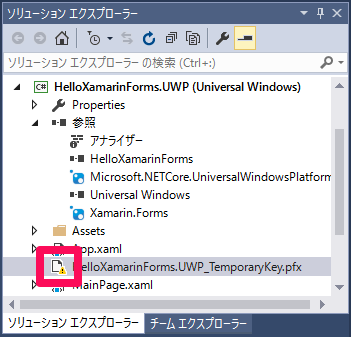  
無視してもビルドは出来るようですが、気になる場合は、別のUWPプロジェクトから`pfx`ファイルをコピーしてきて、ファイル名を`HelloXamarinForms.UWP_TemporaryKey.pfx`に変更してビルドしなおしてください。

Windows 10のビルド環境がなく、Windows 8.1などからビルドする場合は［リモートデバッグ］を使用してネットワーク上のWindows 10タブレットなどに配布することもできます。

まずは配布対象のWindows 10マシンに [Remote Tools for Visual Studio 2015 Update 1](https://www.microsoft.com/ja-jp/download/details.aspx?id=49986) をダウンロード、インストールし、［ツール］－［オプション］から［認証なし］を選択して、待ち受け状態にしておきます。  
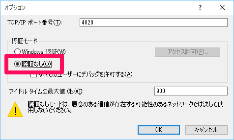  
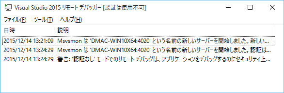

ビルド元のVisual Studioのメニューから［デバッグ］－［XXXのプロパティ］をクリックします。  
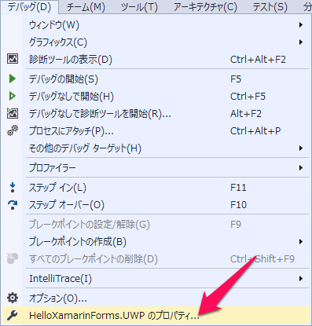

［ターゲットデバイス］を［リモートコンピューター］にして、［検索］ボタンをクリックします。  
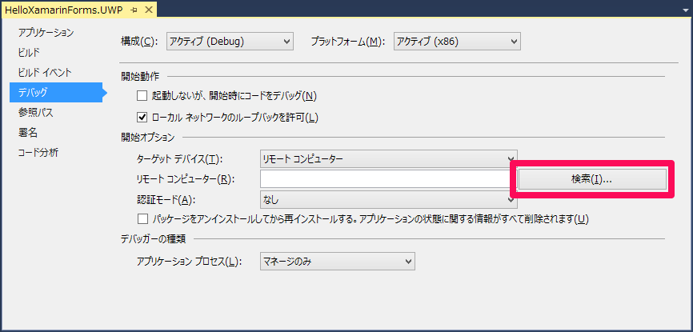

リストされたマシンから対象マシンを選択し、ビルドしてみましょう。Windows 10 Mobile端末を持っていれば、USBで接続してビルドすることもできます。  
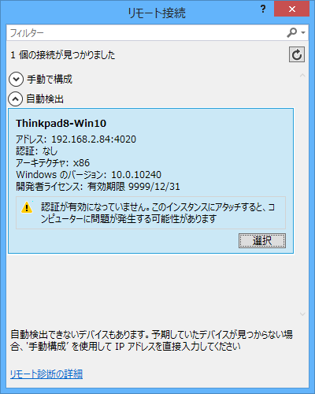  

Windows 10 タブレット（タブレットモード）での実行  
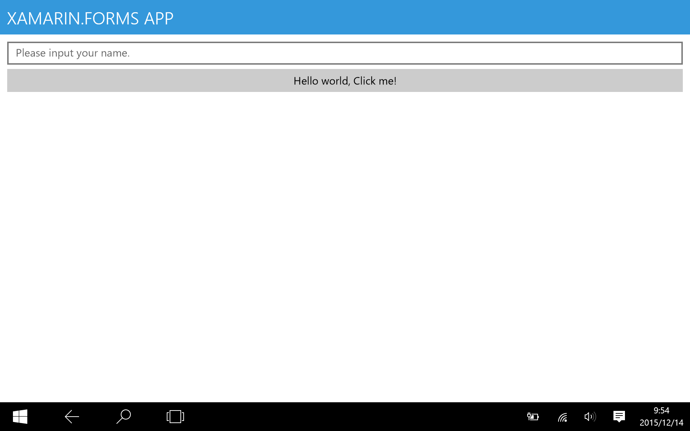

Windows 10 Mobileでの実行  
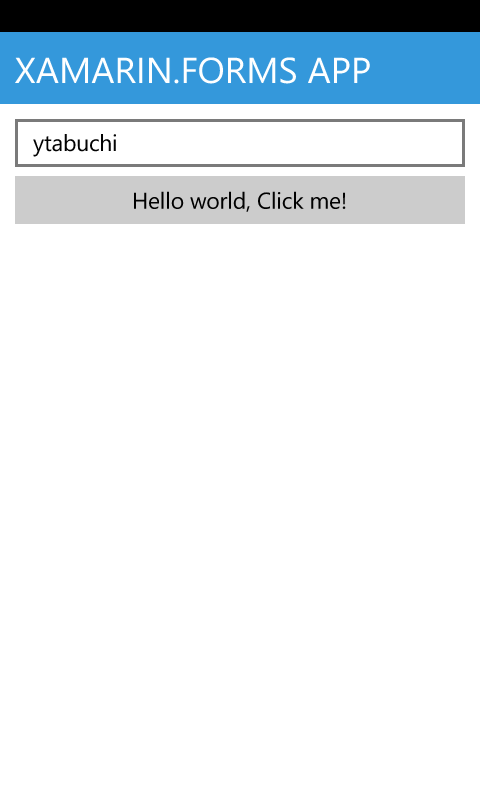

次はWindows81プロジェクトでストアアプリをビルドしてみましょう。  
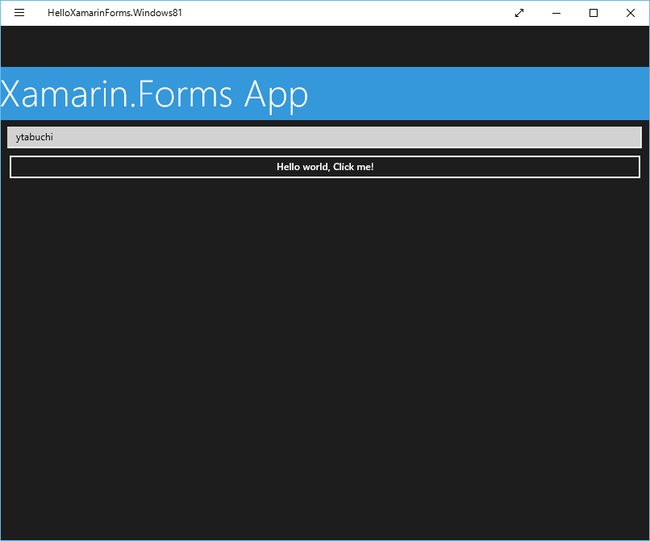

最後にWindows Phone 8.0（Sliverlight）プロジェクトと、Windows Phone 8.1（WinRT）をビルドしてみましょう。  
 
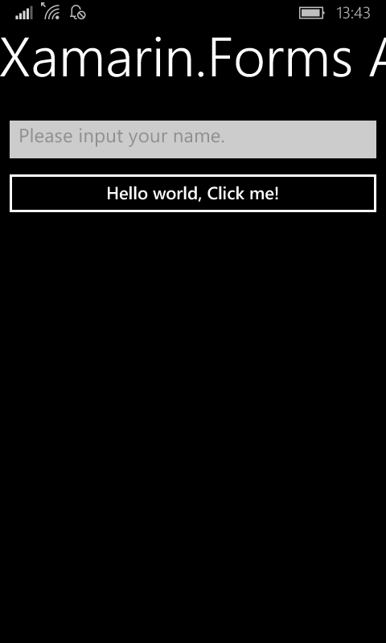

Xamarin.FormsでiOS／Android／UWP／Windows Phone／Windows Storeの様々なOSにアプリが作成できるのがお分かりいただけるかと思います。

評価版で色々試してみていただけると嬉しいです。

以上です。

